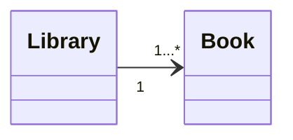

# SpringBoot ManyToOne example (Library - Book)

## Description
This repository contains an SpringBoot example of entity - relationship of many-to-one, using the relationship between libraries and books.

## Technologies
SpringBoot, Java, Maven, Postman, Swagger-UI, Git, Markdown

## Execution
1. Create .env file with the following content:
```env
DB_URL=jdbc:mysql://localhost:3306/<database_name>
DB_USERNAME=<database_username>
DB_PASSWORD=<database_password>
```
2. From IntelliJ IDEA: run "Application" class.
3. Import SpringBoot.postman_collection.json to Postman or use Swagger-UI.

## API
### Endpoints
| Entity  | Method | Endpoint            | Description                     |
|---------|--------|---------------------|---------------------------------|
| Library | GET    | /api/library        | List all libraries              |
| Library | GET    | /api/library/{id}   | Get library by ID and its books |
| Library | POST   | /api/library        | Create library                  |
| Library | PUT    | /api/library/{id}   | Update library                  |
| Library | DELETE | /api/library/{id}   | Delete library                  |
| Book    | GET    | /api/books          | List all books                  |
| Book    | GET    | /api/books/{id}     | Get book by ID                  |
| Book    | GET    | /api/books/library/{id} | Get books by library ID     |
| Book    | POST   | /api/books          | Create book                     |
| Book    | PUT    | /api/books/{id}     | Update book                     |
| Book    | DELETE | /api/books/{id}     | Delete book                     |

### Swagger-UI
[Request List](http://localhost:8080/swagger-ui.html)
- ⚠️Watch out! For pageable requests, it is necessary to remove the parameter <code>"sort": ["string"]</code> .⚠️

## Tree structure:
```batch
...
├── src
│   └── main
│       ├── java
│       │   └── zzz.master.REST.library.MTO
│       │       ├── Controllers
│       │       │   ├── BookController.java
│       │       │   └── LibraryController.java
│       │       ├── Entities
│       │       │   ├── BookEntity.java
│       │       │   └── LibraryEntity.java
│       │       ├── Repositories
│       │       │   ├── BookRepository.java
│       │       │   └── LibraryRepository.java
│       │       └── Application.java
│       └── resources
│           └── application.properties
├── .env
├── pom.xml
├── README.md
└── SpringBoot.postman_collection.json
```

## Relation
